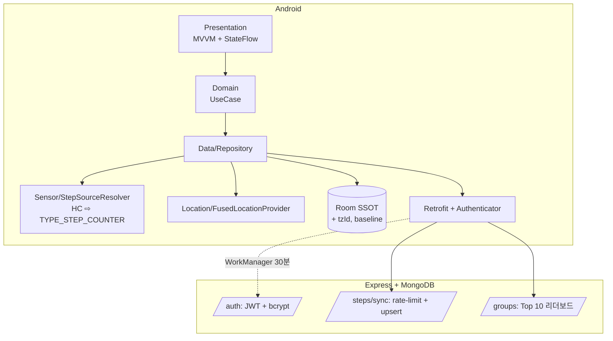

# WalkMate

> **Android(Kotlin/MVVM/Coroutines) + Backend(Express/JWT/MongoDB) + 배포(Render Starter)까지 혼자서 production-ready 수준으로 만든 헬스케어 풀스택 프로젝트.** 개발 중 발견·해결한 백엔드 보안 결함 3개와 Android 14 FGS Type 함정을 README에 기록했습니다.

[](https://github.com/lsk30323/walkmate/actions)
[]()
[]()
[]()

---

## ⏱ 30초 데모


> 시퀀스: 권한 허용(2s) → 걸음수 표시(2s) → 산책 시작/경로(3s) → 종료/저장(2s) → 그룹 Top 10 랭킹(2s) → README 화면(1s) — 총 12초

---

## 🎯 풀스택으로 무엇을 풀었나

> 신입 포트폴리오에서 흔히 'Android만' 또는 '백엔드만'에서 끝나는 한계를 넘어, **양쪽 모두에서 production 수준의 함정을 직접 부딪혀 해결**했습니다.

### Backend (Express + MongoDB + JWT)

| 발견한 보안 결함 | 적용한 해결 |
|---|---|
| 인증 endpoint 브루트포스 무방어 | `express-rate-limit` 5회/분 (auth) + 30회/분 (전역) |
| `/steps/sync` 걸음수 위변조 가능 (일일 제한 없음) | upsert + 일일 상한 50,000보 검증 (Zod) + 한국 bbox 좌표 게이트 |
| OkHttp Authenticator 401 자동 갱신 시 재진입 race | mutex 직렬화 + refresh 실패 시 즉시 logout |

### Android (Kotlin + MVVM + Foreground Service)

| 함정 | 해결 |
|---|---|
| **Android 14 FGS Type** 누락 시 즉시 크래시 | `foregroundServiceType="health"` / `"location"` 명시 |
| 만보기 앱이 **재부팅 시 오늘 걸음수가 0으로 망가짐** | `BOOT_COUNT` 비교 + `baselineSensorValue` 분리 스키마로 baseline 보정 |
| **자정·해외 이동 시** 걸음수 날짜가 꼬임 | `LocalDate.now(ZoneId.systemDefault())` + `tzId` 필드 명시 저장 |
| Health Connect 미설치 시 동작 불가 | `StepSourceResolver`: HC 우선 → Sensor fallback |

### Infra (Render Starter $7/월 — 무료티어 폐지 사실 반영)

| 결정 | 근거 |
|---|---|
| Render Starter $7/월 유료 채택 | Railway 무료티어 2023년 폐지 / Render 무료는 cold start 15-45초 (제출 시점 동작 보장 X) |
| LRU 캐시 차등 (Geocoding 7일 / Reverse 24h) | Naver API 일일 30k 한도 보호 + KST 자정 quota reset |
| Prometheus `_stats` 엔드포인트 | 일일 사용량 80% 도달 시 알림 메트릭 |

---

## 🏗 아키텍처



---

## 🛠 기술 스택

**Android**: Kotlin · MVVM · Coroutines/StateFlow · Hilt · Room · Retrofit/OkHttp · Health Connect · Google Maps SDK · Foreground Service · WorkManager · GitHub Actions CI

**Backend**: Node.js · Express · MongoDB · JWT · `express-rate-limit` · Render Starter ($7/월)

> 모든 핵심 결정은 [`docs/adr/`](docs/adr) 5개 ADR로 즉시 기록. 추측이 아니라 결정 시점의 컨텍스트가 보존됩니다.

---

## 📊 회고 — 무엇이 잘 되고 무엇이 무너졌나

### 잘 된 것
- (Week 끝 작성)

### 무너진 것
- (Week 끝 작성)

### 알려진 한계 (의도적으로 안 한 것 + 사유)
- **Baseline Profile/Macrobenchmark 미적용** — 신입 포트폴리오 ROI 대비 1.5일 공수 무거워 Week 10 스트레치로 내림. 향후 v1.1.
- **걸음수 위조 방지 알고리즘 미적용** — 실측 4.5일 vs 견적 2일의 갭이 커서 P/R 보장 어려움. README에서만 한계 명시.
- **Wear OS 컴패니언 미지원** — 10주 일정 흡수 불가.

---

## 🚧 Trouble Shooting

### 1. Step Counter 재부팅 후 0으로 초기화
**증상**: 폰 재부팅 후 앱 다시 띄우니 오늘 걸음수가 누적값 그대로 → 갑자기 10,000보 추가.

**원인**: `TYPE_STEP_COUNTER`는 부팅 이후 누적값이라, 재부팅 시 0부터 다시 시작. baseline을 폰 메모리에만 저장하면 부팅 후 초기화 감지 불가.

**해결**:
```kotlin
val nowBoot = Settings.Global.getInt(contentResolver, "boot_count", 0)
if (nowBoot != savedBootCount) {
    // 재부팅 감지: baselineSensorValue를 0으로 리셋, 그 시점부터 누적
    saveBaseline(sensorValue = 0, bootCount = nowBoot)
}
```

### 2. Android 14 빌드 후 startForeground 즉시 크래시
**증상**: `targetSdk=34` 변경 후 첫 실행에서 `ForegroundServiceTypeNotAllowedException`.

**원인**: Android 14부터 `foregroundServiceType` 선언 + `startForeground(id, notif, type)` 시그니처 호출 모두 필수.

**해결**: AndroidManifest.xml에 `android:foregroundServiceType="health"` 추가 + `startForeground(NOTIF_ID, notif, FOREGROUND_SERVICE_TYPE_HEALTH)` 변경.

### 3. (1건 더 추가 예정 — Week 5 Health Connect 또는 Week 7 OkHttp Authenticator 재진입 등)

---

## 🚀 실행 방법

```bash
# Android
git clone https://github.com/lsk30323/walkmate.git
cd walkmate/android
./gradlew assembleDebug

# Backend
cd ../backend
cp .env.example .env  # NAVER_CLIENT_ID 등 채우기
npm install && npm run dev
```

---

## 📚 참고

- 실제 워크온/스왈라비 채용공고 분석 시트: [`docs/jd-matching-sheet.md`](docs/jd-matching-sheet.md)
- 면접 답변 스크립트: [`docs/interview-prep.md`](docs/interview-prep.md)
- ADR 5개: [`docs/adr/`](docs/adr)
